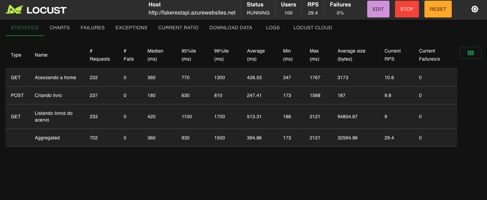
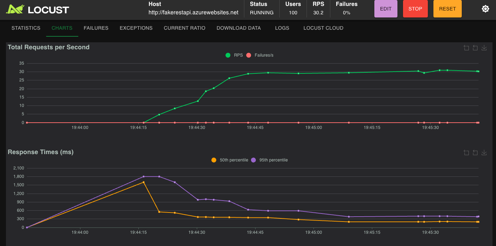

# 🏎️ Testes de Performance com Locust

Este projeto contém testes de performance utilizando o [Locust](https://docs.locust.io/), uma ferramenta open-source para simulação de carga e estresse em aplicações web.

A URL utilizada nos testes é:  
👉 [Fake REST API](http://fakerestapi.azurewebsites.net/index.html)

## Estrutura do Projeto
```Bash
├── venv/                       # Ambiente virtual Python  
├── performanceTests.py         # Arquivo principal com os testes de performance  
└── README.md                   # Documentação do projeto
```

## Instalação e Configuração

1. Clone o repositório:  
```bash
git clone <url-do-repositorio>
cd <nome-do-projeto>
```

2. Criar e ativar o ambiente virtual:
```bash
# Criar a venv
python -m venv venv

# Ativar no Linux/Mac
source venv/bin/activate

# Ativar no Windows
venv\Scripts\activate
```
3. Instalar dependências:
```bash
pip3 install locust
```

## Executando os Testes
Dentro do ambiente virtual, execute:
```bash
locust -f performanceTests.py
````

Por padrão, o Locust abrirá a interface web em http://localhost:8089

Na interface é possível configurar:

- Número de usuários simulados (Users)

- Taxa de spawn (Spawn rate)

- Host da API

## Resultados dos Testes (Interface Locust)

📊 Estatísticas



📈 Gráficos



## Documentação Oficial

Locust: https://docs.locust.io